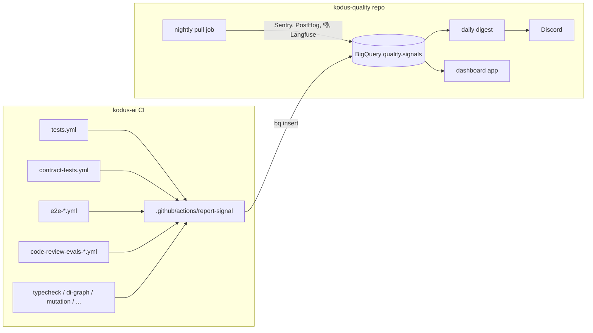

# Quality signals: one table, one page

Master plan. Each task below is sized for one agent session and is opened as its own issue
(`issue-draft`) when picked up. Tasks marked **human** cannot be done by an agent without
console access; everything else is agent work end to end, including verification.

## Why

Every quality signal we have already runs somewhere, and none of them keep history in a
place you can query:

| Signal | Where it lives today |
|---|---|
| Unit tests (jest) | `tests.yml` → GitHub check + Discord |
| Typecheck, DI graph, permissions matrix, env drift, mutation score | one workflow each → GitHub check |
| Contract tests, BYOK live | `contract-tests.yml` → GitHub check + Discord |
| E2E (self-hosted matrix, cloud, cloud-aws, health report) | scoreboard in step summary + Discord |
| Evals (nightly recall, Friday tier-0, wiring smoke, model benchmark) | job summary + artifact + Discord, hand-kept ledger in `evals/results` |
| Prod errors | Sentry, PostHog error tracking, weekly kodus-insights digest |
| 👎 on suggestions | BigQuery mirror of prod, weekly kodus-insights buckets |
| Review latency and cost | Langfuse |

Discord is the de facto aggregator. It has no history and no query. That is the gap.

## Shape



Rules that keep it simple:

- **Push, not pull, for CI.** A workflow writes its own row at the end. Nothing reads the
  GitHub API to reconstruct results.
- **Pull only for what has no workflow**: Sentry, PostHog, 👎, Langfuse. One nightly job.
- **One row = one signal at one instant.** The dashboard never computes a status; it shows
  the one the producer wrote.
- **Producers live in kodus-ai. Everything else lives in a new repo `kodustech/kodus-quality`**
  (pull job, digest, dashboard). The dashboard is not a product feature: it does not ride
  the release train and does not ship in the self-hosted image.

## Contract: `quality.signals`

BigQuery, project `kody-408918`, dataset `quality`.

```sql
CREATE TABLE quality.signals (
  ts        TIMESTAMP NOT NULL,
  source    STRING    NOT NULL,  -- 'kodus-ai/tests.yml' | 'kodus-quality/pull' | ...
  name      STRING    NOT NULL,  -- see naming below
  status    STRING    NOT NULL,  -- green | yellow | red | skipped | infra
  value     FLOAT64,             -- the number, when there is one
  unit      STRING,              -- 'ratio' | 'count' | 'usd' | 'ms' | 'pct'
  run_url   STRING,              -- where a human goes to see why
  commit    STRING,
  branch    STRING,
  meta      JSON                 -- anything else (per-model breakdown, failed test names, ...)
) PARTITION BY DATE(ts) CLUSTER BY name;
```

Views: `signals_latest` (last row per `name`), `signals_daily` (last row per `name` per day).

**Status semantics.** `green`/`red` is the gate's own verdict. `yellow` is advisory (matrix
advisories, mutation below target without break). `skipped` is a deliberate skip (path
filter, no key configured on a fork). `infra` is "could not measure": quota, missing secret,
network. `infra` is never a quality result and the dashboard shows it grey, not red.

**Naming.** `<area>.<gate>[.<dimension>]`, lowercase, dots only:

```
unit.jest                        value = failed tests, unit = count, meta.total
gate.typecheck | gate.di_graph | gate.permissions_matrix | gate.env_drift
gate.mutation                    value = mutation score, unit = pct
contract.api                     contract.byok_live   meta.models
e2e.selfhosted.matrix            value = gating_count, meta.advisory_count, meta.setup_skipped
e2e.cloud | e2e.cloud_aws | e2e.health
evals.wiring                     evals.nightly.recall (ratio)  evals.nightly.precision
evals.nightly.cost (usd)         evals.tier0.<model>           evals.benchmark.<model>.f1
prod.sentry.<app>.new_issues     prod.sentry.<app>.unresolved  (count, 24h window)
prod.posthog.<app>.errors        (count, 24h)
feedback.thumbs_down.count       feedback.thumbs_down.rate (ratio, 24h)   meta.top_rules
review.langfuse.latency_p95 (ms) review.langfuse.cost_per_review (usd)
```

Adding a signal = one new `name` and one call to the action. No schema change.

## Tasks

### T0. GCP wiring — **human, ~30 min, blocks everything**

- Create dataset `quality` in `kody-408918`.
- Service account `quality-signals-writer` with `roles/bigquery.dataEditor` on that dataset
  only, and `roles/bigquery.jobUser` on the project.
- Workload Identity Federation pool + provider for GitHub, bound to
  `kodustech/kodus-ai` and `kodustech/kodus-quality`. No JSON key.
- Repo variables on both repos: `GCP_WIF_PROVIDER`, `GCP_SA_EMAIL`, `GCP_PROJECT=kody-408918`.
- A second service account `quality-dashboard-reader` (`bigquery.dataViewer` + `jobUser`),
  JSON key stored where the dashboard deploy reads it (T6).

An agent with `gcloud` authed as an owner can do this; hand it the commands, not the console.

### T1. Schema and docs — kodus-ai

- `scripts/quality/signals.sql`: DDL above plus the two views. Idempotent (`CREATE TABLE IF NOT EXISTS`).
- `scripts/quality/apply.sh`: runs it with `bq query`.
- `docs/quality-signals.md`: the contract section of this file, plus "how to add a signal" in
  ten lines. This plan file is deleted once that doc exists.
- Verify: `apply.sh` twice against the dataset; `bq show quality.signals`.

### T2. Composite action `.github/actions/report-signal` — kodus-ai

Mirror `.github/actions/discord-notify` (same header comment style, same graceful
degradation).

- Inputs: `name`, `status`, `value` (optional), `unit` (optional), `meta` (optional JSON string),
  `run_url` (default: this run). `source`, `commit`, `branch` from the GitHub context.
- Steps: `google-github-actions/auth@v2` (WIF) → `setup-gcloud` → build `row.json` → `bq insert quality.signals row.json`.
- If `GCP_WIF_PROVIDER` is empty: `::warning` and exit 0. A missing variable never fails a workflow.
- Call site rule: always `if: always()` so red runs are rows too.
- Verify: a `workflow_dispatch`-only workflow `quality-signal-smoke.yml` that writes
  `name=smoke.report_signal`; run it; `SELECT * FROM quality.signals WHERE name='smoke.report_signal'` returns the row.

### T3. Producers — kodus-ai, one PR per workflow, all parallel after T2

Each PR: add the step, run the workflow once, show the row in the PR description. Where the
number already exists, read it; do not recompute.

| Workflow | What to read | Rows |
|---|---|---|
| `tests.yml` | `jest --json --outputFile` (add the flag), `numFailedTests`, `numTotalTests` | `unit.jest` |
| `typecheck-gate.yml`, `di-graph-gate.yml`, `permissions-matrix-check.yml`, `env-drift-check.yml` | job status | `gate.*` |
| `mutation-gate.yml` | Stryker JSON report score | `gate.mutation` |
| `contract-tests.yml` | job status per job; BYOK summary text → `meta` | `contract.api`, `contract.byok_live` |
| `e2e-self-hosted-matrix.yml` | `steps.scoreboard.outputs.{status,gating_count,advisory_count,setup_skipped}` | `e2e.selfhosted.matrix` |
| `e2e-cloud.yml`, `e2e-cloud-aws.yml`, `e2e-health-report.yml` | job status; scoreboard where it exists | `e2e.cloud`, `e2e.cloud_aws`, `e2e.health` |
| `code-review-evals-pr.yml` | job status | `evals.wiring` |
| `code-review-evals-nightly.yml` | `nightly-report/state.json` (verdict → status), `nightly.json` (recall, precision, cost) | `evals.nightly.recall`, `.precision`, `.cost` |
| `code-review-evals-tier0.yml` | per-model result dir | one `evals.tier0.<model>` row per model |
| `code-review-model-benchmark.yml` | scores per model | `evals.benchmark.<model>.f1` |

Map `verdict`/`status` to the five statuses in one shared shell snippet inside the action
(`success→green`, `failure→red`, `cancelled→infra`, `skipped→skipped`), and let the
producer override when it knows better (nightly "não mediu" → `infra`, matrix advisories → `yellow`).

Start with the nightly and the matrix: they already hold a number and a verdict.

### T4. Repo `kodustech/kodus-quality` — bootstrap

- pnpm workspace, Node 22, TypeScript. Packages: `pull/`, `digest/`, `dashboard/`.
- `bq` client: `@google-cloud/bigquery`, auth via WIF in Actions and via the reader key locally.
- Secrets it needs: `SENTRY_AUTH_TOKEN`, `POSTHOG_API_KEY`, `LANGFUSE_PUBLIC_KEY`/`SECRET_KEY`,
  `DISCORD_WEBHOOK_QUALITY`. Listed in the README; the human adds them once.

### T5. Pull job — kodus-quality, nightly 05:00 UTC

One workflow, one row per signal per night, all writing through the same insert helper:

- **Sentry**: for each project (api, worker, webhooks, web): issues first seen in the last 24h
  (`new_issues`), unresolved total (`unresolved`). `meta.top` = 5 issue titles + links.
  Status: `red` if `new_issues` above a per-app threshold in `config.json`, else `green`.
- **PostHog**: error tracking issues in the last 24h per app. Same shape.
- **👎**: query the BigQuery prod mirror (the SEOCopilot dataset already used by the weekly
  buckets pipeline): suggestions posted vs thumbs-down in the last 24h. `meta.top_rules` = the
  T0-regex detectors and rules with most 👎. Status by rate threshold.
- **Langfuse**: `observations` for the last 24h: review latency p50/p95, cost per review.
- Verify: run once by `workflow_dispatch`; `SELECT name, status, value FROM quality.signals_daily WHERE DATE(ts)=CURRENT_DATE()` lists every name above.

### T6. Dashboard — kodus-quality, Next.js, deployed on Railway

Not Looker Studio, not Grafana. A small app we own, so any agent can change it.

- Next.js 15 App Router, server components only, no client fetching. Reads BigQuery
  server-side with `quality-dashboard-reader`. Google sign-in (NextAuth) restricted to
  `@kodus.io`. Nothing else is exposed.
- One page. A grid grouped by area (`unit`, `gate`, `contract`, `e2e`, `evals`, `prod`,
  `feedback`, `review`). Each tile: name, latest status as colour, latest value, 30-day
  sparkline from `signals_daily`, link to `run_url`. Grey for `infra`, hatched for `skipped`.
- A second view `/history/<name>`: table of every row for that name, newest first, with `meta` expanded.
- No filters, no date pickers, no auth roles in v1. The whole point is that it fits on one screen.
- Deploy: Railway service from the repo, `main` auto-deploys. Domain `quality.kodus.io`.
- Verify: Playwright test that loads the page against a seeded BigQuery dataset and asserts
  every `name` in `signals_latest` renders a tile. Screenshot in the PR.

### T7. Daily digest — kodus-quality, 08:00 BRT

- Query `signals_latest` joined with yesterday: everything that turned red, everything
  still red (with day count, like the nightly's "dia N"), everything that recovered.
- One Discord message, link to the dashboard. Silent when nothing changed.
- Once this runs for two weeks, the per-workflow Discord posts in kodus-ai are candidates
  for removal, one PR each.

### T8. Retire the hand-kept ledger — kodus-ai

`evals/results` becomes a query on `quality.signals` (name `evals.*`). Follow `evals/AGENTS.md`
for the eval-side change. Do this last: it is the only task that removes something.

## Order and parallelism

```
T0 (human) → T1 → T2 → T3 (10 PRs in parallel)
T0 (human) → T4 → T5 ┐
                     ├→ T6 → T7 → T8
              T3 ────┘
```

T1, T2, T4 are one session each. T3 is ten small sessions. T5 and T6 are one or two sessions
each. T7 is one. Total: roughly 20 agent sessions and 30 human minutes.

## What an agent must not do

- Never write to BigQuery datasets other than `quality`.
- Never store a JSON key in a repo, an `.env` committed to git, or a workflow file.
- Never query prod Postgres or Mongo directly for a signal: everything comes from the mirror,
  Sentry, PostHog, Langfuse or a workflow's own output.
- A PR touching `evals/**` follows `evals/AGENTS.md` and carries eval evidence.
